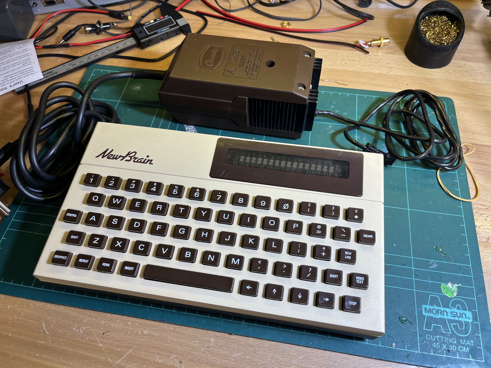

# Grundy_NewBrain
Hopefully I can contribute something to the community. 

My current goal is to re-design the "store board" to use a 32KB SRAM instead of the two banks of 16KB DRAM. 

I think this is the last remaining fault in my machine. 

Failing ... or succeeding ... that, I'd like to try at a 64KB external SRAM board. 

{Fri 15-Sept-2023} 
Sent SRAM Store Board prototype for fabrication 
{Sat 1-Mar-2025} 
Well, what a disaster that was.  Fixed my (obvious) mistakes and have sent the updated design for fabrication. 

My YouTube video playlist - note, most are my very early videos so probably a bit rough: 
[https://www.youtube.com/playlist?list=PL5pwokf56wMKPswNvQZJsGPXETtgRD57M](https://www.youtube.com/playlist?list=PL5pwokf56wMKPswNvQZJsGPXETtgRD57M)
