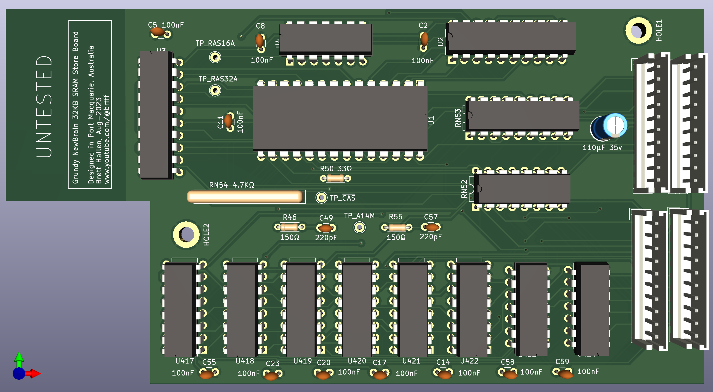

# Grundy NewBrain Store Board

This is the internal RAM board in the NewBrain. 

It comprises two banks of 16KB, making 32KB in total.  Each bank has eight MM5290N-2 (16K x 1bit) DRAM chips. 

The DRAM is multiplexed using two RAS signals (RAS16 for bank 1 and RAS32 for bank 2) and one CAS signal. 

My idea to replace these DRAM with a single 32KB SRAM is as follows: 
- There are only eight address lines taken across to the store board: A0 to A6 & A14 
- As per other DRAM-to-SRAM designs, latch the RAS signals and apply with CAS 
- Simplify the two RAS16 & RAS32 signals to a single RAS signal for clocking the row address latch 

Let's see ... (4-Sep-2023) 

Thanks to John Bradley for his Kicad schematics: 
https://github.com/flypie/NewBrain 
